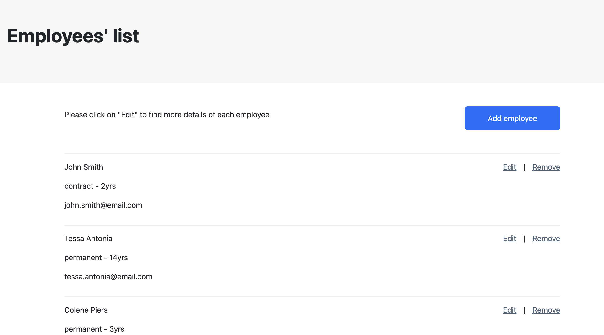
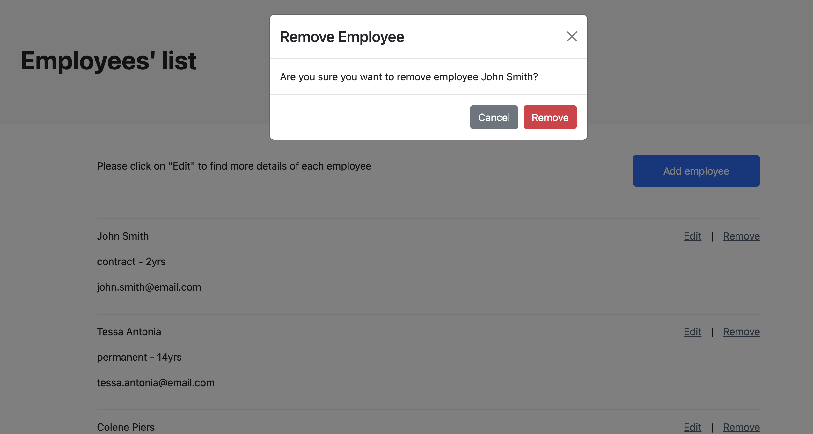
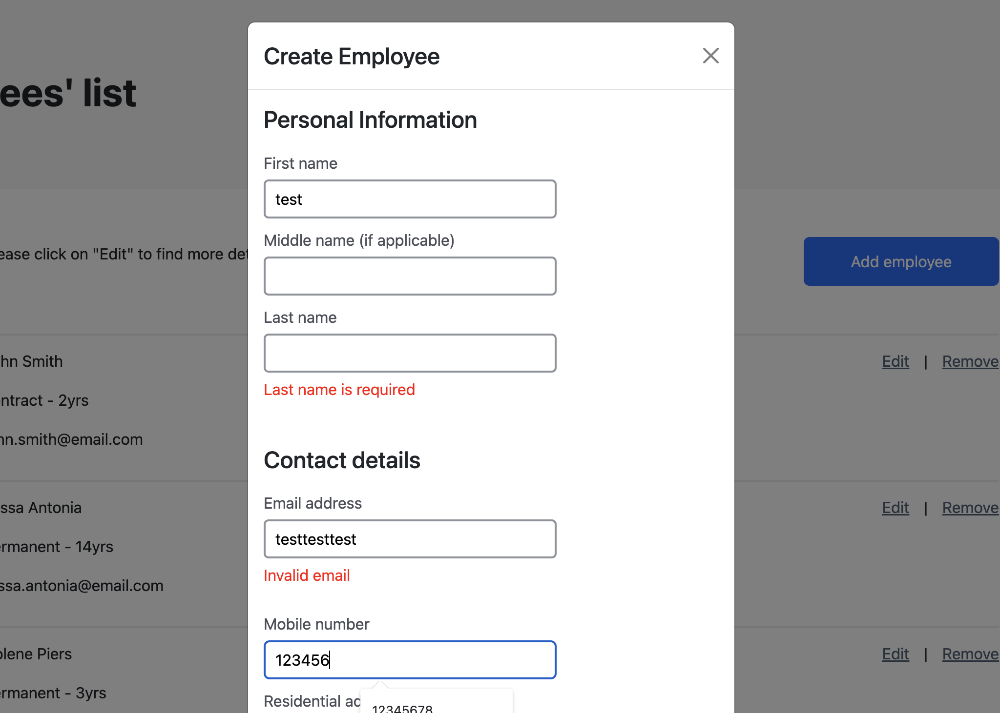
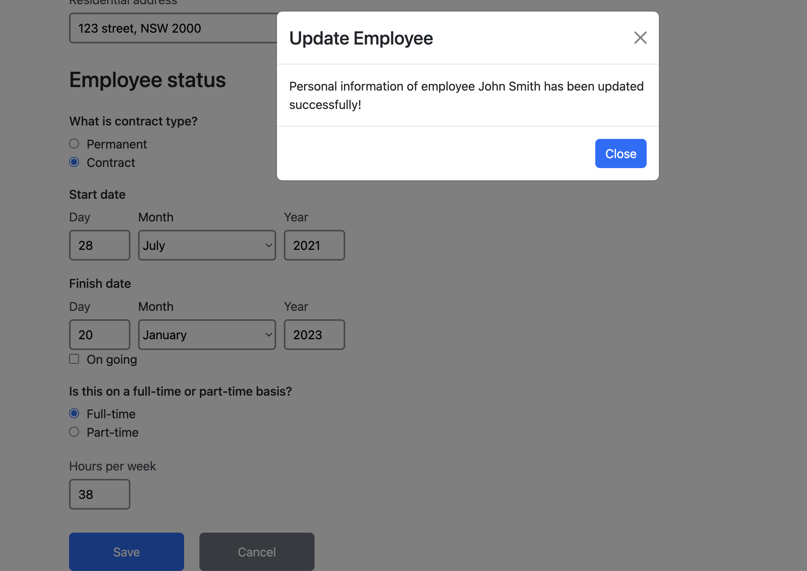

# Employee-creator

This is the frontend part of a web application to create, list, modify and delete employees. The application consists of a spring RESTful API and a React Typescript frontend. 

## Table of Contents

- [Snippets](#snippets)
- [Purpose](#purpose-of-project)
- [Tech Stack](#tech-stack)
- [Requirements](#requirements)
    - [React hints](#react-hints)
- [Features](#features)
- [Known Issues](#known-issues)
- [Future Goals](#future-goals)

## Snippets
 

## Purpose Of Project
This project is designed to demonstrate my understanding of writing frontend using React Typescript, React Form Hook and other React hooks.

## Tech Stack

- React
- Typescript
- SCSS
- Axios
- React Form Hook
- React Query
- Zod

## Requirements
We need a web application to create, list, modify and delete employees. The application should consist of a spring RESTful API and a React Typescript frontend. The schema for the employee is left to the criteria of the candidate.

### React hints
- React Redux is recommended.
- Typescript is recommended.
- React hooks are recommended.
- React create app is a good starting point.
- You can include any other open source NPM library.
- Feel free to use your favorite CSS framework.
- Feel free to use your favorite middleware.
- Add some basic validations on the form like required and max length validations.
- The site should be responsive.

## Features

- The employees page has a list of all the employees in the database with some basic informations, the button "Edit" will open the employee updating page, and the button "Remove" will delete the employee from the database, and the page will be updated with the employee removed without refreshing:

- There is a "Add employee" button on the top, by clicking it a modal of a form with all the fields need to be filled in for the employee's information will display. Since Zod is used for validation purpose, if some of the required fields are left empty or filled with an invalid value, an error message with red colour will display under the input box:

- By clicking the Edit button, it will route to the employee's personal information page. The information can be updated on this page and save to the database by clicking the "Save" button at the bottom:

## Known Issues  
 The validation part is too basic, there is no validation of valid mobile number or date format

## Future Goals

- Add test
- Add more validation
- Add auto-complete for address entering
